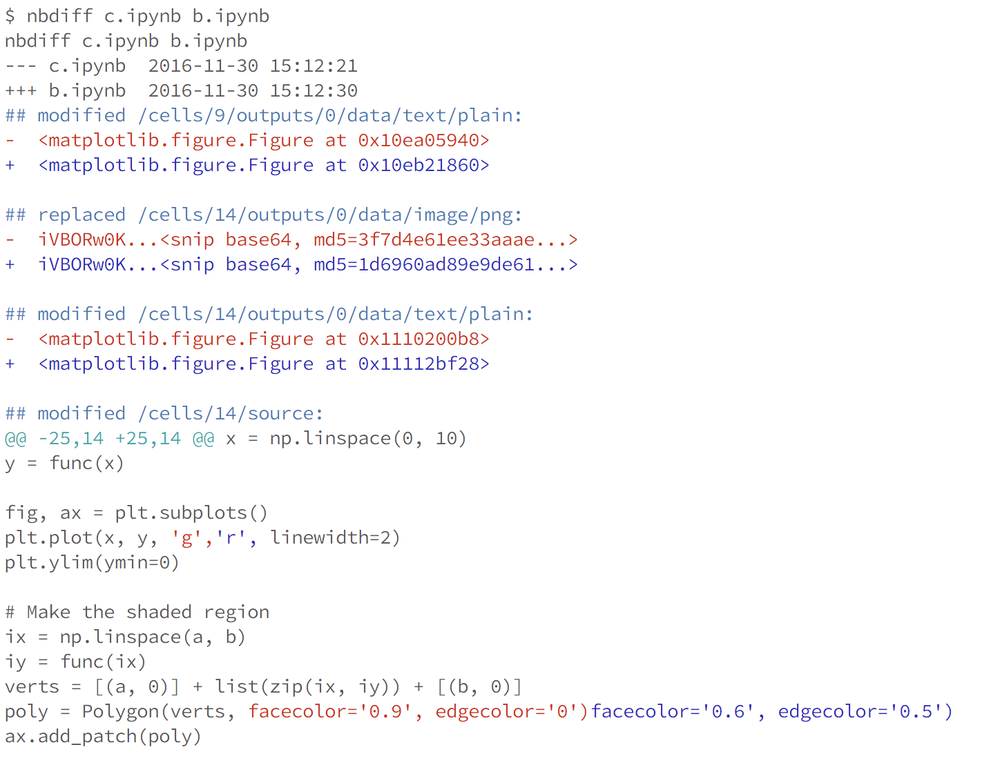
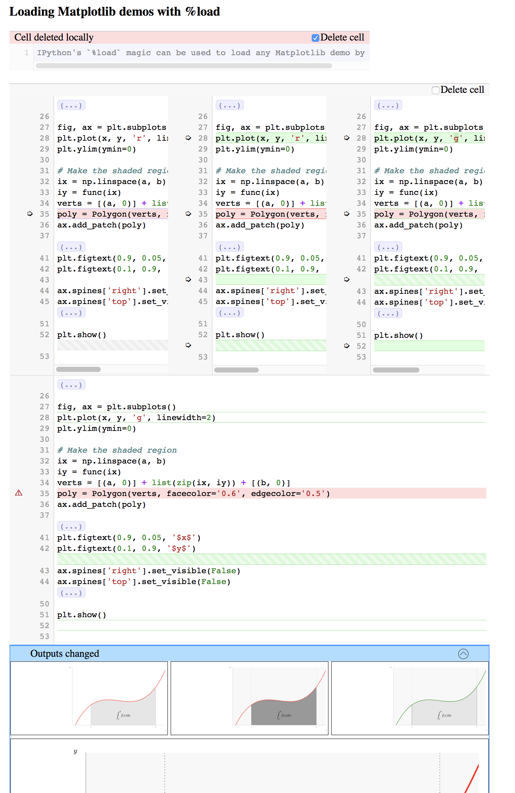

**[Installation](#installation)** |
**[Documentation](#documentation)** |
**[Contributing](#contributing)** |
**[Development Install](#development-install)** |
**[Testing](#testing)** |
**[License](#license)** |
**[Getting help](#getting-help)**

# [nbdime](https://github.com/jupyter/nbdime) Jupyter Notebook Diff and Merge tools

[](https://travis-ci.org/jupyter/nbdime)
[](https://codecov.io/github/jupyter/nbdime?branch=master)
[](http://nbdime.readthedocs.io/en/latest/?badge=latest)
[](https://groups.google.com/forum/#!forum/jupyter)

`nbdime` provides tools for diffing and merging of [Jupyter Notebooks](https://jupyter-notebook.readthedocs.io).

- `nbdiff` compare notebooks in a terminal-friendly way
- `nbmerge` three-way merge of notebooks with automatic conflict resolution
- `nbdiff-web` shows you a rich rendered diff of notebooks
- `nbmerge-web` gives you a web-based three-way merge tool for notebooks
- `nbshow` present a single notebook in a terminal-friendly way

Diffing notebooks in the terminal:



Merging notebooks in a browser:



## Installation

Install nbdime with pip:

    pip install nbdime

See [the installation docs](https://nbdime.readthedocs.io/en/latest/installing.html) for more installation details and development installation instructions.

## Documentation

See the latest documentation at https://nbdime.readthedocs.io.

See also description and discussion in the [Jupyter Enhancement Proposal](https://github.com/jupyter/enhancement-proposals/pull/8).

## Contributing

If you would like to contribute to the project, please read our [contributor documentation](http://jupyter.readthedocs.io/en/latest/contributor/content-contributor.html) and the [`CONTRIBUTING.md`](CONTRIBUTING.md).

## Development Install

To install a development version of nbdime, you will need [npm installed](https://nodejs.org/en/download/) and available on your PATH while installing.

For a **development install**, enter on the command line:

```bash
pip install -e git+https://github.com/jupyter/nbdime#egg=nbdime
```

See [installation](https://nbdime.readthedocs.io/en/latest/installing.html#installing-latest-development-version) documentation for additional detail.

## Testing

Install the test requirements:

    pip install nbdime[test]

To run Python tests locally, enter on the command line: `pytest`

To run Javascript tests locally, enter: `npm test`

Install the [codecov browser extension](https://github.com/codecov/browser-extension#codecov-extension) to view test coverage in the source browser on github.

See [testing](https://nbdime.readthedocs.io/en/latest/testing.html) documentation for additional detail.

## License

We use a shared copyright model that enables all contributors to maintain the
copyright on their contributions.

All code is licensed under the terms of the revised BSD license.

## Getting help

We encourage you to ask questions on the [mailing list](https://groups.google.com/forum/#!forum/jupyter).

## Resources

- [Reporting Issues](https://github.com/jupyter/nbdime/issues)
- [Documentation for nbdime](https://nbdime.readthedocs.io/en/latest/) | [PDF (latest)](https://media.readthedocs.org/pdf/nbdime/latest/nbdime.pdf)

- [Documentation for Project Jupyter](https://jupyter.readthedocs.io/en/latest/index.html) | [PDF](https://media.readthedocs.org/pdf/jupyter/latest/jupyter.pdf)
- [Project Jupyter website](https://jupyter.org)
