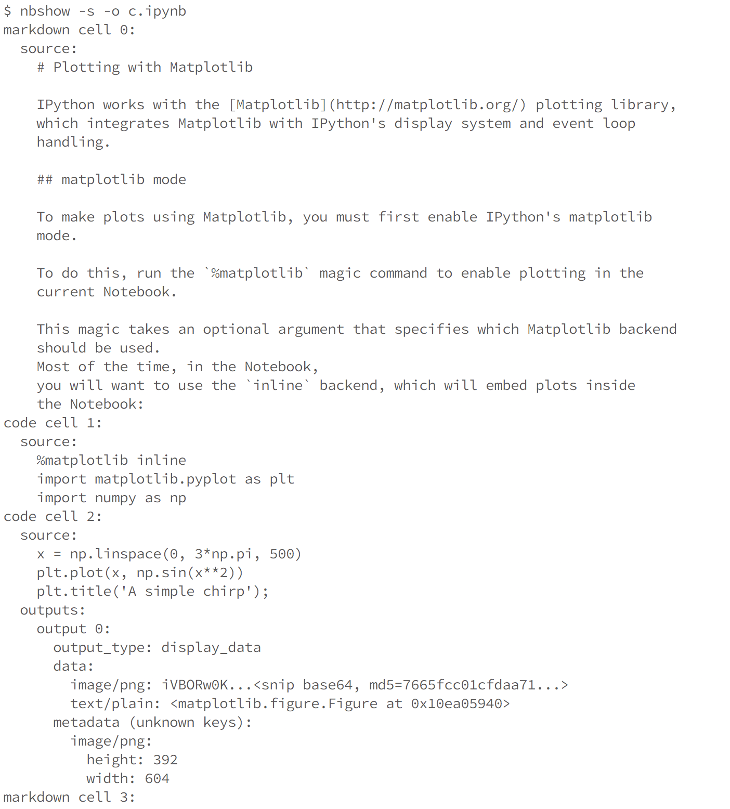
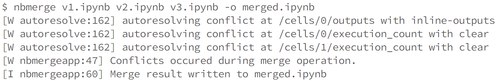

================
Console commands
================

nbdime provides the following CLI commands::

    nbshow
    nbdiff
    nbdiff-web
    nbmerge
    nbmerge-web
    mergetool
    config-git

Pass ``--help`` to each command to see help text for the command's usage.

Additional commands are available for :ref:`git-integration`.

nbshow
======

:command:`nbshow` gives you a nice, terminal-optimized summary view of a notebook.
You can use it to quickly peek at notebooks without launching the full notebook web application.

Diffing
=======

nbdime offers two commands for viewing the diff between two notebooks:

- :command:`nbdiff` for command-line diffing
- :command:`nbdiff-web` for rich web-based diffing of notebooks

.. seealso::

    For more technical details on how nbdime compares notebooks, see :doc:`diffing`.

nbdiff
------

:command:`nbdiff` does a terminal-optimized rendering of notebook diffs.
Pass it the two notebooks you would like to compare,
and it returns a nice, readable presentation of the changes in the notebook.

.. image:: images/nbdiff-terminal.png

nbdiff-web
----------

Like :command:`nbdiff`, :command:`nbdiff-web` compares two notebooks.

Instead of a terminal rendering, :command:`nbdiff-web` opens a web browser,
compares the two notebooks, and displays the rich rendered diff of images and
other outputs.

.. image:: images/nbdiff-web.png

Common diff options
-------------------

You can specify which parts of the notebooks to compare for the diff, by supplying
the following flags to any of the diff commands:

    - ``--sources`` / ``-s``
    - ``--outputs`` / ``-o``
    - ``--metadata`` / ``-m``
    - ``--attachments`` / ``-a``

These flags can be combined, e.g. `-sm` will only process source and metadata.
Alternatively, you can supply some arguments to process everything *except* some
parts:

    - ``--ignore-sources`` / ``-S``
    - ``--ignore-outputs`` / ``-O``
    - ``--ignore-metadata`` / ``-M``
    - ``--ignore-attachments`` / ``-A``

Merging
=======

Merging notebook changes and dealing with merge conflicts are important parts
of a development workflow. With notebooks, merging changes is a non-trivial
technical task. Traditional, line-based tools can produce invalid notebooks
that you have to fix by hand,
which is no fun at all, or can risk unintended data loss.

nbdime provides some improved tools for merging notebooks,
taking into account knowledge of the notebook file format
to ensure that a valid notebook is always produced.
Further, by understanding details of the notebook format,
nbdime can automatically resolve conflicts on generated fields.

.. seealso::

    For more details on how nbdime merges notebooks, see :doc:`merging`.

nbmerge
-------

:command:`nbmerge` merges two notebooks with a common parent.
If there are conflicts, they are stored in metadata of the destination file.
:command:`nbmerge` will exit with nonzero status if there are any unresolved
conflicts.

:command:`nbmerge` writes the output to ``stdout`` by default,
so you can use pipes to send the result to a file,
or the ``-o, --output`` argument to specify a file in which to save the merged notebook.

Because there are several categories of data in a notebook (such as input, output, and metadata),
nbmerge has several ways to deal with conflicts,
and can take different actions based on the type of data with the conflict.

The ``-m, --merge-strategy`` option lets you select a global strategy to use.
The following options are currently implemented:

inline
    This is the default.
    Conflicts in input and output are recorded with conflict markers, while
    conflicts on metadata are stored in the appropriate metadata (actual
    values are kept as their base values).

    This gives you a valid notebook that you can open in your usual notebook editor
    and resolve conflicts by hand,
    just like you might for a regular source file in your text editor.
use-base
    When a conflict is encountered, use the value from the base notebook.
use-local
    When a conflict is encountered, use the value from the local notebook.
use-remote
    When a conflict is encountered, use the value from the remote notebook.
union
    When a conflict is encountered, include both the local and the remote
    value, in that order (local then remote). Conflicts on non-sequence
    types (anything not list or string) are left unresolved.

.. note::

    The union strategy might resolve to nonsensical values, while still marking
    conflicts as resolved, so use this carefully.

The ``--input-strategy`` and ``--output-strategy`` options lets you specify a
strategy to use for conflicts on inputs and outputs, respecively. They accept
the same values as the ``--merge-strategy`` option. If these are set, they will
take precedence over ``--merge-strategy`` for inputs and/or outputs.
``--output-strategy`` takes two additional options: ``remove`` and ``clear-all``:

remove
    When a conflict is encountered on a single output,
    remove that output.
clear-all
    When a conflict is encountered on any output in a given code cell,
    clear all outputs for that cell.

To use nbmerge, pass it three notebooks:

- ``base``: the base, common parent notebook
- ``local``: your local changes to base
- ``remote``: other changes to base that you want to merge with yours

For example::

    nbmerge base.ipynb local.ipynb remote.ipynb > merged.ipynb

nbmerge-web
-----------

:command:`nbmerge-web` is just like :command:`nbmerge` above,
but instead of automatically resolving or failing on conflicts,
a webapp for manually resolving conflicts is displayed::

    nbmerge-web base.ipynb local.ipynb remote.ipynb -o merged.ipynb

.. image:: images/nbmerge-web.png

