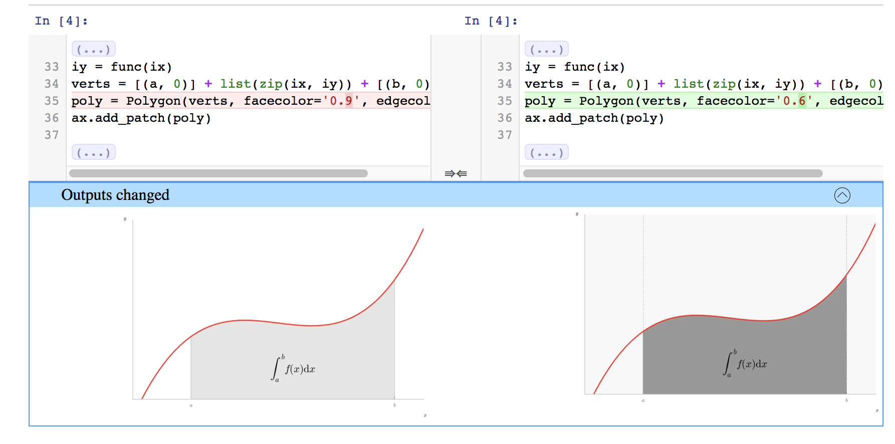

===========
diff format
===========

This sections provide details on how nbdime represents diffs, and will mostly
be relevant for those who want to use nbdime as a library, or that want
to contribute to nbdime.

   Figure: nbdime's content-aware diff

Basics
------

A :term:`diff object` represents the difference ``B-A`` between two objects, ``A`` and
``B``, as a list of operations (ops) to apply to ``A`` to obtain ``B``. Each
operation is represented as a dict with at least two items::

    { "op": <opname>, "key": <key> }

The objects ``A`` and ``B`` are either mappings (dicts) or sequences (lists or
strings). A different set of ops are legal for mappings and sequences.
Depending on the op, the operation dict usually contains an additional
argument, as documented below.

The diff objects in nbdime are:

   - json-compatible nested structures of dicts (with string keys) and
   - lists of values with heterogeneous datatypes (strings, ints, floats).

The difference between these input objects is represented by a
json-compatible results object. A JSON schema for validating diff
entries is available in
`diff_format.schema.json <https://github.com/jupyter/nbdime/blob/master/nbdime/diff_format.schema.json>`_.

Diff format for mappings
------------------------

For mappings, the key is always a **string**.

Valid operations (ops) are:

    * **remove** - delete existing value at ``key``::

        { "op": "remove", "key": <string> }

    * **add** - insert new value at ``key`` not previously existing::

        { "op": "add", "key": <string>, "value": <value> }

    * **replace** - replace existing value at ``key`` with new value::

        { "op": "replace", "key": <string>, "value": <value> }

    * **patch** - patch existing value at ``key`` with another ``diffobject``::

        { "op": "patch", "key": <string>, "diff": <diffobject> }

Diff format for sequences
-------------------------

For sequences (list and string) the key is always an **integer index**.  This
index is relative to object ``A`` of length ``N``.

Valid operations (ops) are:

    * **removerange** - delete the values ``A[key:key+length]``::

        { "op": "removerange", "key": <string>, "length": <n>}

    * **addrange** - insert new items from ``valuelist`` before ``A[key]``,
      at end if ``key=len(A)``::

        { "op": "addrange", "key": <string>, "valuelist": <values> }

    * **patch** - patch existing value at ``key`` with another ``diffobject``::

        { "op": "patch",   "key": <string>, "diff": <diffobject> }

Relation to JSONPatch
---------------------

The above described diff representation format has similarities with the
:term:`JSONPatch` standard but is also different in a few ways:

**operations**
   - JSONPatch contains operations ``move``, ``copy``, ``test`` not used by
     nbdime.
   - nbdime contains operations ``addrange``, ``removerange``, and ``patch``
     not in JSONPatch.

**patch**
   - JSONPatch uses a deep JSON pointer based ``path`` item in each
     operation instead of providing a recursive ``patch`` op.
   - nbdime uses a ``key`` item in its ``patch`` op.

**diff object**
   - JSONPatch can represent the diff object as a *single list*.
   - nbdime uses a *tree of lists*.

To convert a nbdime diff object to the JSONPatch format, use the ``to_json_patch``
function::

    from nbdime.diff_format import to_json_patch
    jp = to_json_patch(diff_obj)

.. note::

   This function ``to_json_patch`` is currently a draft, subject to change,
   and not yet covered by tests.

Examples
--------

For examples of diffs using nbdime, see `test_patch.py <https://github.com/jupyter/nbdime/blob/master/nbdime/tests/test_patch.py>`_.
