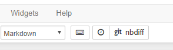

===================
Notebook Extensions
===================

Installation
============

To install and enable the nbdime jupyter extensions, run::

    nbdime extensions --enable [--sys-prefix/--user/--system]

Or, if you prefer full control, you can run the individual steps::

    jupyter serverextension enable --py nbdime [--sys-prefix/--user/--system]

    jupyter nbextension install --py nbdime [--sys-prefix/--user/--system]
    jupyter nbextension enable --py nbdime [--sys-prefix/--user/--system]

    jupyter labextension install nbdime-jupyterlab

This will install the nbdime notebook server extension, the notebook
frontend extension, and the jupyterlab frontend extension.

The ``--system`` (default) and ``--user`` flags determine which users
the extensions will be configured for. Note that you should
use ``--sys-prefix`` to only enable it for the currently active
virtual environment (e.g. with conda or virtualenv).

Usage
=====

After installing the extensions, one or two buttons should show up in the
notebook toolbar, as shown in the figure below.

   Figure: nbdime's buttons in the notebook extension.

Clicking the git button will open a new tab showing the diff between
the last commit and the *currently saved* version of the notebook. Note that
this button will only be visible if the notebook is currently in a git
repository.

Clicking the checkpoint button will similarly show the diff between the
*checkpointed* and *currently saved* versions of the notebook.

Removal
=======

To disable and uninstall the nbdime jupyter extensions, run::

    nbdime extensions --disable [--sys-prefix/--user/--system]

Or, if you prefer full control, you can run the individual steps::

    jupyter serverextension disable --py nbdime [--sys-prefix/--user/--system]

    jupyter nbextension disable --py nbdime [--sys-prefix/--user/--system]
    jupyter nbextension uninstall --py nbdime [--sys-prefix/--user/--system]

    jupyter labextension uninstall nbdime-jupyterlab

The flags are the same as for the installation step.

If your extension install/configuration gets messed up, run::

    jupyter --paths

And search the folders under the "config" and "data" headers for traces
of nbdime. The configuration might be located in separate nbdime.json files,
and/or have specific entries in other config files.
