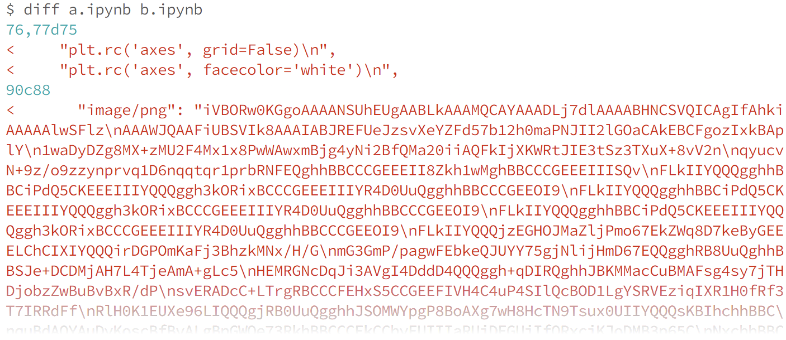

nbdime -- diffing and merging of Jupyter Notebooks
==================================================

Version: |release|

**nbdime** provides tools for diffing and merging `Jupyter notebooks`_.

.. figure:: images/nbdiff-web.png
   :alt: example of nbdime nbdiff-web

   Figure: nbdime example

Why is nbdime needed?
---------------------

Jupyter notebooks are useful, rich media documents stored in a plain text JSON format.
This format is relatively easy to parse. However, primitive line-based diff and merge tools
do not handle well the logical structure of notebook documents. These tools
yield diffs like this:

   Figure: diff using traditional line-based diff tool

**nbdime**, on the other hand, provides "content-aware" diffing and merging of
Jupyter notebooks. It understands the structure of notebook documents.
Therefore, it can make intelligent decisions when diffing and merging notebooks,
such as:

- eliding base64-encoded images for terminal output
- using existing diff tools for inputs and outputs
- rendering image diffs in a web view
- auto-resolving conflicts on generated values such as execution counters

nbdime yields diffs like this:

.. figure:: images/nbdiff-web.png
   :alt: example of nbdime's content-aware diff

   Figure: nbdime's content-aware diff

Quickstart
----------

To get started with nbdime, install with pip::

    pip install nbdime

And you can be off to the races by diffing notebooks in your terminal with :command:`nbdiff`::

    nbdiff notebook_1.ipynb notebook_2.ipynb

or viewing a rich web-based rendering of the diff with :command:`nbdiff-web`::

    nbdiff-web notebook_1.ipynb notebook_2.ipynb

For more information about nbdime's commands, see :doc:`cli`.

Git integration quickstart
**************************

Many of us who are writing and sharing notebooks do so with git and GitHub.
Git doesn't handle diffing and merging notebooks very well by default,
but you can configure git to use nbdime and it will get a lot better.

The quickest way to get set up for git integration is to call::

    nbdime config-git --enable --global

.. versionadded:: 0.3

    :command:`nbdime config-git`. Prior to 0.3, each nbdime entrypoint had to enable git integration separately.

This will enable the both the drivers and the tools for both diff and merge.

Now when you do :command:`git diff` or :command:`git merge` with notebooks,
you should see a nice diff view, like this:

.. figure:: images/nbdiff-terminal.png
   :alt: nbdime's command-line diff

   Figure: nbdime's 'content-aware' command-line diff

To use the web-based GUI viewers of notebook diffs, call::

    nbdiff-web [<commit> [<commit>]] [<path>]

See the `git diff documentation`_ for further explanation of "<commit>" and
"<path>" for this command.

.. versionadded:: 0.3

    support for passing git refs to nbdime commands

.. figure:: images/nbdiff-web.png
   :alt: example of nbdime's content-aware diff

   Figure: nbdime's content-aware diff

If you have a merge conflict in a notebook, the merge driver will ensure
that the conflicted notebook is a valid notebook that can be viewed in
the normal notebook viewer. In it, the conflicts will be marked similarly
to how git would normally indicate conflicts, and they can be resolved
manually. Alternatively, nbdime provides a web-base mergetool for visualizing
and resolving merge conflicts, and it can be launched by calling::

    nbdime mergetool

.. figure:: images/nbmerge-web.png
   :alt: nbdime's merge with web-based GUI viewer

   Figure: nbdime's merge with web-based GUI viewer

For more detailed information on integrating nbdime with version control, see :doc:`vcs`.

Contents
--------

.. toctree::
   :maxdepth: 2
   :caption: Installation and usage

   installing
   extensions
   cli
   vcs
   config
   glossary
   changelog

.. toctree::
   :maxdepth: 2
   :caption: Development

   testing
   diffing
   merging
   restapi

.. toctree::
   :maxdepth: 2
   :caption: Planning

   usecases

Acknowledgements
----------------

nbdime is developed with financial support from:

- OpenDreamKit Horizon 2020 European Research Infrastructures project (`CORDIS 676541`_), http://opendreamkit.org .

- The Gordon and Betty Moore Foundation through Grant `GBMF 4856`_, by the Alfred P. Sloan Foundation and by the Helmsley Trust.

.. links

.. _`Jupyter notebooks`: http://jupyter-notebook.readthedocs.io/en/latest/

.. _`git diff documentation`: https://git-scm.com/docs/git-diff
.. _`CORDIS 676541`: https://cordis.europa.eu/project/id/676541
.. _`GBMF 4856`: https://www.moore.org/grant-detail?grantId=GBMF4856
