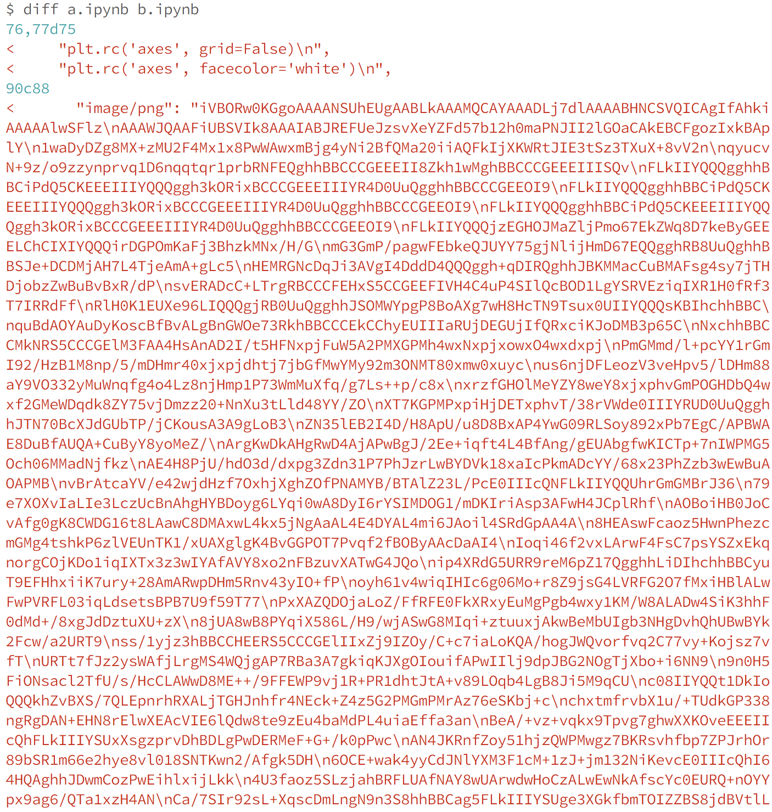

nbdime -- diffing and merging of Jupyter Notebooks
==================================================

Version: |release|

**nbdime** provides tools for diffing and merging `Jupyter notebooks`_.

.. figure:: images/nbdiff-web.png
   :alt: example of nbdime nbdiff-web

   Figure: nbdime example

Abstract
--------

Jupyter notebooks are useful, rich media documents stored in a plain text JSON format.
This format is relatively easy to parse. However, primitive line-based diff and merge tools
do not handle well the logical structure of notebook documents. These tools
yield diffs like this:

   Figure: diff using traditional line-based diff tool

**nbdime**, on the other hand, provides "content-aware" diffing and merging of
Jupyter notebooks. It understands the structure of notebook documents.
Therefore, it can make intelligent decisions when diffing and merging notebooks,
such as:

- eliding base64-encoded images for terminal output
- using existing diff tools for inputs and outputs
- rendering image diffs in a web view
- auto-resolving conflicts on generated values such as execution counters

nbdime yields diffs like this:

.. figure:: images/nbdiff-web.png
   :alt: example of nbdime's content-aware diff

   Figure: nbdime's content-aware diff

Quickstart
----------

To get started with nbdime, install with pip::

    pip install nbdime

And you can be off to the races by diffing notebooks in your terminal with :command:`nbdiff`::

    nbdiff notebook_1.ipynb notebook_2.ipynb

or viewing a rich web-based rendering of the diff with :command:`nbdiff-web`::

    nbdiff-web notebook_1.ipynb notebook_2.ipynb

For more information about nbdime's commands, see :doc:`cli`.

Git integration quickstart
**************************

Many of us who are writing and sharing notebooks do so with git and GitHub.
Git doesn't handle diffing and merging notebooks very well by default,
but you can configure git to use nbdime and it will get a lot better.

To configure git to use nbdime as a command-line driver to diff and merge notebooks::

    git-nbdiffdriver config --enable --global
    git-nbmergedriver config --enable --global

Now when you do :command:`git diff` or :command:`git merge` with notebooks,
you should see a nice diff view, like this:

.. figure:: images/nbdiff-terminal.png
   :alt: nbdime's command-line diff

   Figure: nbdime's 'content-aware' command-line diff

To configure git to use the web-based GUI viewers of notebook diffs and merges::

    git-nbdifftool config --enable --global
    git-nbmergetool config --enable --global

With these, you can trigger the :command:`tools` with::

    git difftool --tool nbdime [ref [ref]]

.. figure:: images/nbdiff-web.png
   :alt: example of nbdime's content-aware diff

   Figure: nbdime's content-aware diff

and::

    git mergetool --tool nbdime

.. figure:: images/nbmerge-web.png
   :alt: nbdime's merge with web-based GUI viewer

   Figure: nbdime's merge with web-based GUI viewer

.. note::

    Using :command:`git-nbdiffdriver config` overrides the ability to call
    :command:`git difftool` with notebooks.

    You can still call :command:`nbdiff-web` to diff files directly,
    but getting the files from git refs is still on our TODO list.

For more detailed information on integrating nbdime with version control, see :doc:`vcs`.

Contents
--------

.. toctree::
   :maxdepth: 2
   :caption: Installation and usage

   installing
   cli
   vcs
   testing
   glossary
   changelog

.. toctree::
   :maxdepth: 2
   :caption: Planning

   usecases
   diffing
   merging
   restapi

.. links

.. _`Jupyter notebooks`: http://jupyter-notebook.readthedocs.io/en/latest/
